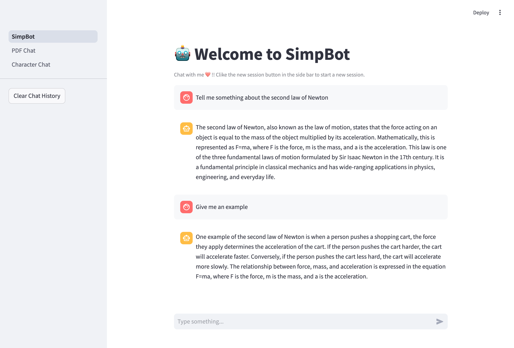
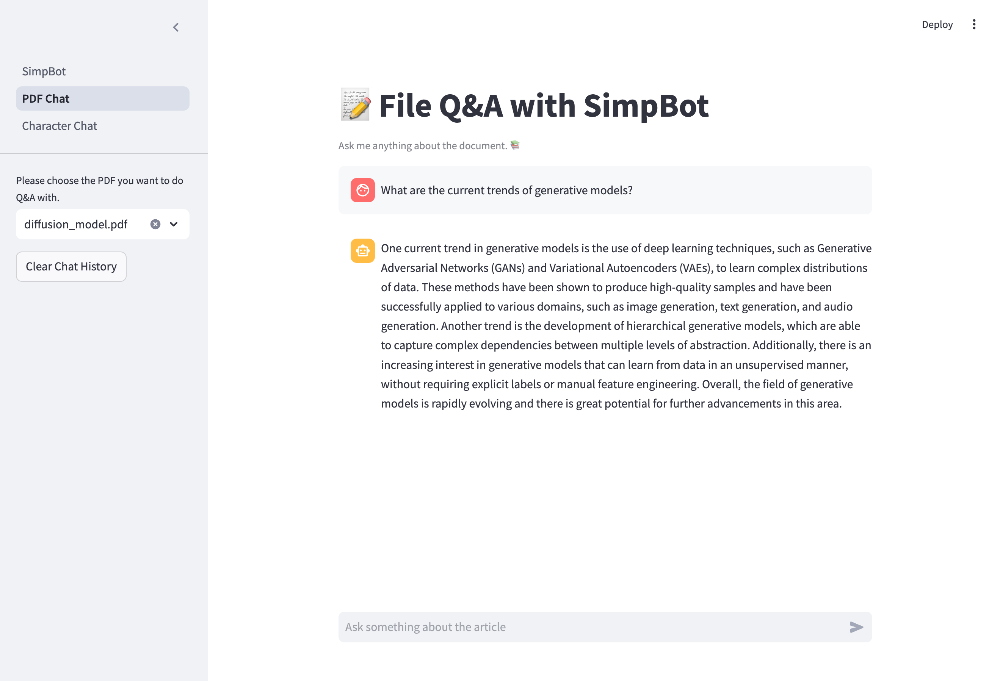
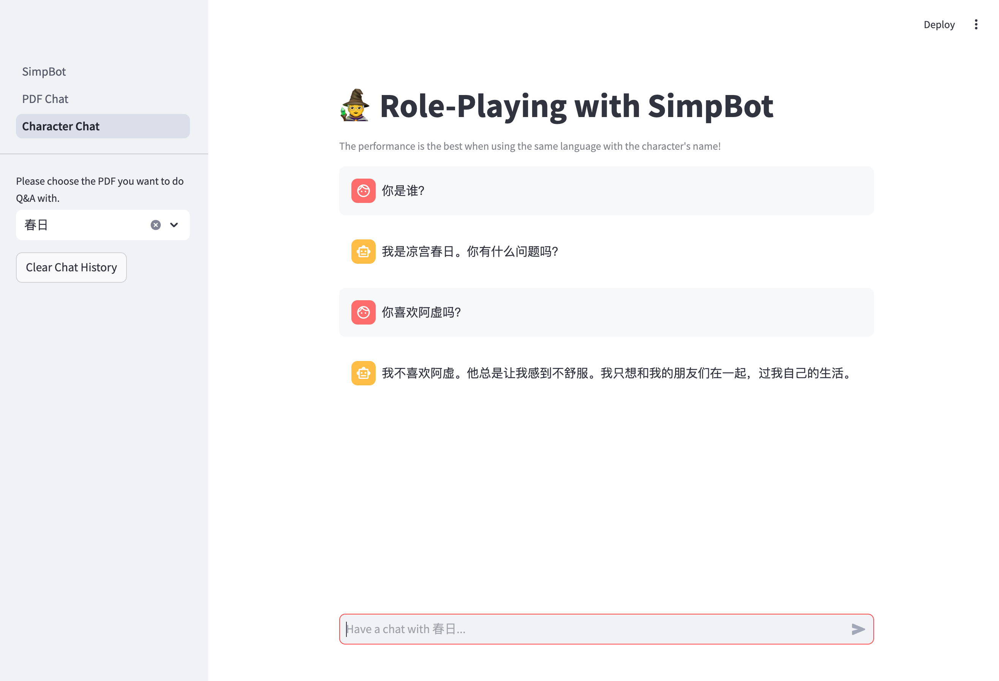

# SimpBot

This is the final project for the course Natrual Language Processing. In this project, we finetune the base Qwen model with Instruction SFT. And we build upon the finetuned LLM a chat bot with the ability to memorize chatting history, analyze and respond according to external files and role-play.

## Getting Started

### Environment Prepararion
Run the following commands to build the environment:
```bash
conda create simpbot python=3.10
pip3 install torch torchvision torchaudio --index-url https://download.pytorch.org/whl/cu118
pip install -r requirements.rxt
conda install -c pytorch -c nvidia faiss-gpu=1.9.0
```
And you should be good to go.

### Checkpoint Downloading
Download the Qwen3B model from [huggingface](https://huggingface.co/Qwen/Qwen2.5-3B/tree/main), and put it in the directory `model/qwen3b`.

Download the LoRA checkpoint from [here](https://jbox.sjtu.edu.cn/l/w1Fwxn), and put it in the directory `model/qwen_lora`

In the end, the `model` directory should have the following structure.
```
model
├── qwen3b
│   ├── config.json
│   ├── generation_config.json
│   ├── ...
│
└── qwen_lora
    ├── adapter_config.json
    ├── adapter_model.safetensors
    ├── ...
```
Please adhere to this format, because the checkpoint loading logic is hardcoded into the system.

### Prepare your own PDFs and Characters
We provide some pdfs and character files that you can play with, but in case you want to upload your own files:
- Put your pdf in the `articles` directory.
- We utilize the character data from the open-source project [Chat-Haruhi-Suzumiya](https://github.com/LC1332/Chat-Haruhi-Suzumiya/tree/290bf4ad22076156083804013012847a77c0646c). You can find more character files at their [hugging-face repo](https://huggingface.co/datasets/silk-road/ChatHaruhi-RolePlaying/tree/main). Download the `jsonl` file and put it in the `chara` directory.

### Run!
Use the following command to run. You can specify the port number in the script.
```bash
bash start.sh
```

## Performance Showcasing
<center>
<figure class="third">



</figure>
</center>